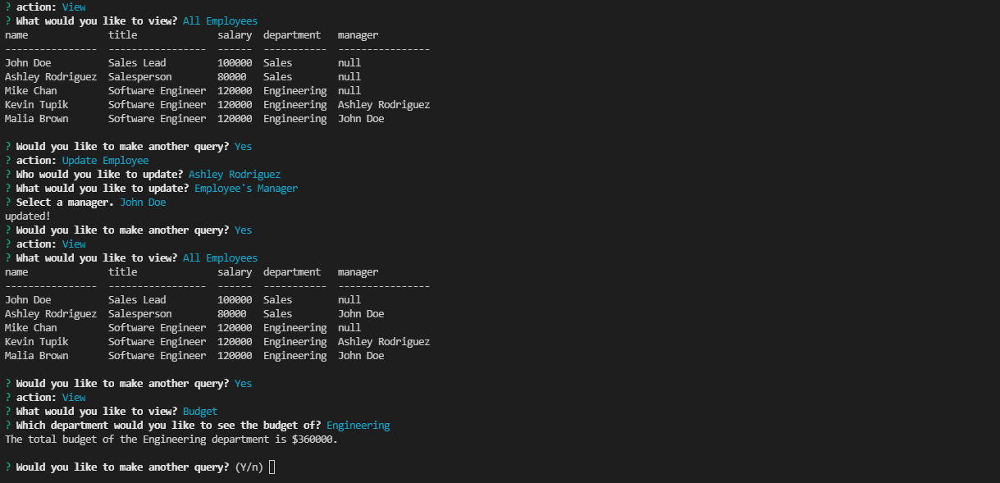

# Employee Tracker
---

## Table of Contents
[Description](#description)
[Installation](#installation)
[Usage](#usage)
[License](#license)
[Contributing](#contributing)
[Tests](#tests)
[Questions](#questions)

---
## Description
Employee tracker is an application that lets you manage a database of employees with various data attributes! It is programmed in JavaScript and uses the Inquierer and MySQL2 packages from npm. The database is only linked locally since I am at this point not sure how to deploy a database.

Here is an image of the application in use:

---
## Installation
In order to install this application first clone the repository down from GitHub, then initlaize npm and type 'npm i' into the terminal. Finally, input input the code from schema.sql from the sql folder into MySQL Workbench. Once you run those queries installation will be complete!

---
## Usage
To use this application just type node app.js into the terminal. This requires having installed Node js.

---
## License
none

---
## Contributing
If you'd like to contribute to this project feel free to clone down the repository and make your own edits. You can email me if you'd like to suggest changes I can make.

---
## Tests
If you want to test out the functionality of this database application then you can run the queries from seed.sql in MySQL Workbench for some dummy data.

---
## Questions
Created by: CharlotteFrancis on GitHub.
[GitHub Profile Link](github.com/CharlotteFrancis)
Contact me at ChiharuTaru@gmail.com if you have any further questions.
